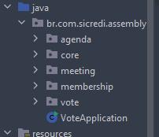
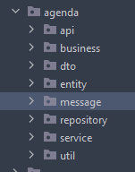
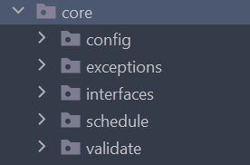
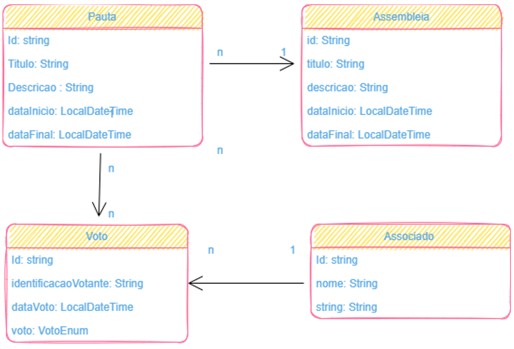

# Introdução 
###A organização do projeto
O projeto foi desenvolvido pensando na facilidade de se conseguir veicular uma seção de votação de uma assembléia para cooperativado. Entendendo que o processo de votação é muito delicado, pois envolve o futuro da cooperativa,
se trouxe como premissa a ideia de que os votos, quando inseridos, não pudessem ser relacionados ao usuário que votou. Além disso, o usuário não pode votar enquanto a pauta não estiver aberta, fazendo com que o sistema mantenha 
a lisura no momento da adição de novos dados. A estrutura do código adotada nesse exercício corrobora para que essas aplicações básicas do sistema sejam devidamente implementadas. 
Sendo assim, optou-se em organizar os códigos por meio de módulos ou nichos de pontos de interesse, refletindo a seguinte organizaçao básica de pacotes:

Ao abrir cada nicho o programador vai se deparar com outros subpacotes que têm como objetivo organizar o código de forma que fique visualmente simples encontrar os códigos que se quer fazer manutenção. 

Cada camada possui uma atribuição, onde as classes estão postas conforme o nome da camada. Então se existe um pacote nomeado "Business", teremos classes que existem para fazer o trânsito de dados conforme as regras de negócio estabelecidas no exercício. A estrutura se diferencia apenas no pacote Core, onde estão contidas classes que serão utilizadas em toda a aplicação de algum modo. 

###A estrutura básica do sistema

Levando em consideração que uma assembleia pode possuir "Y" pautas, que cada pauta pode conter "Z" votantes e " X" votos, pensou-se em uma estrutura que atendesse o mínimo dos requesitos que estavam dispostos no exercício, e mantendo o código adaptável. A estrutura básica do sistema é representada pelo diagrama de classes a seguir: 

###Design Pattern - Utilizados
1. Converter
2. Builder

# Tecnologias que foram utilizadas para implementação do sistema
1.	Kafka - Utilizado para informar que a sessão de votação de determinada pauta foi finalizada. 
2.	MongoDB - Banco de dados não relacional para inserção dos dados no sistema.  
3.	Swagger e Swagger UI - Utilizados para exposição da API em uma interface gráfica. 
4.	API references
5.  Actuator - obtenção de métricas do sistema. 
6.  Log4j - geração de logs 
7.  JUnit e Mockito - Testes unitários e de integração.
8.  Docker e Docker Compose - Implementação do ambiente local. 
